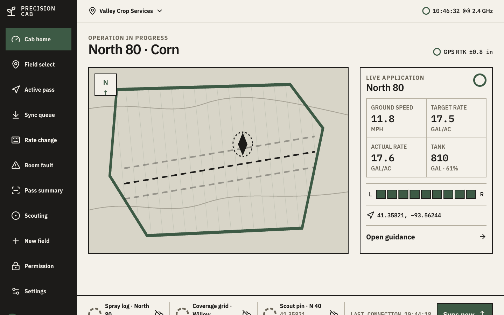
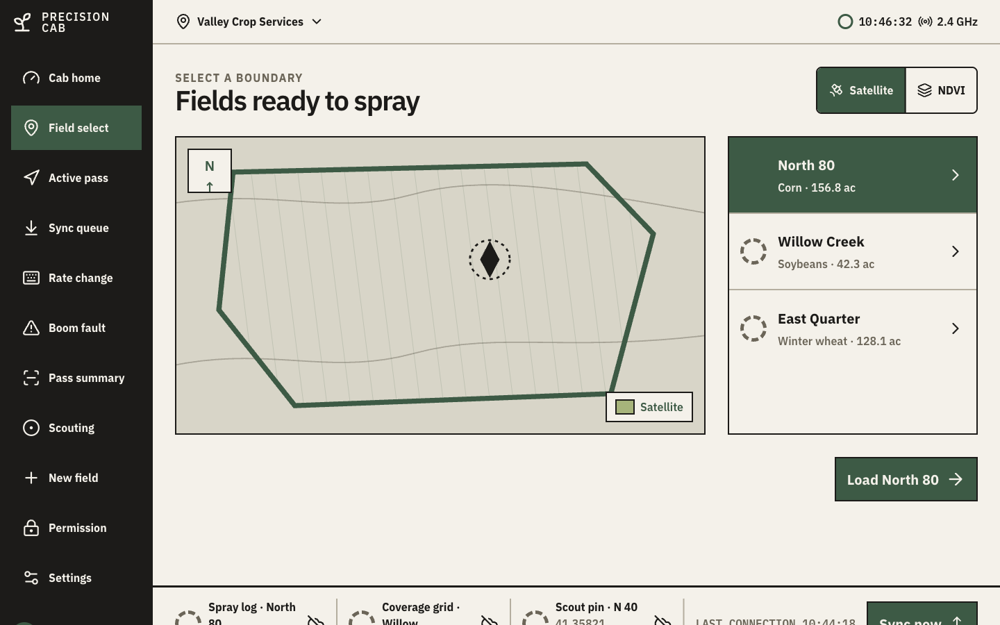
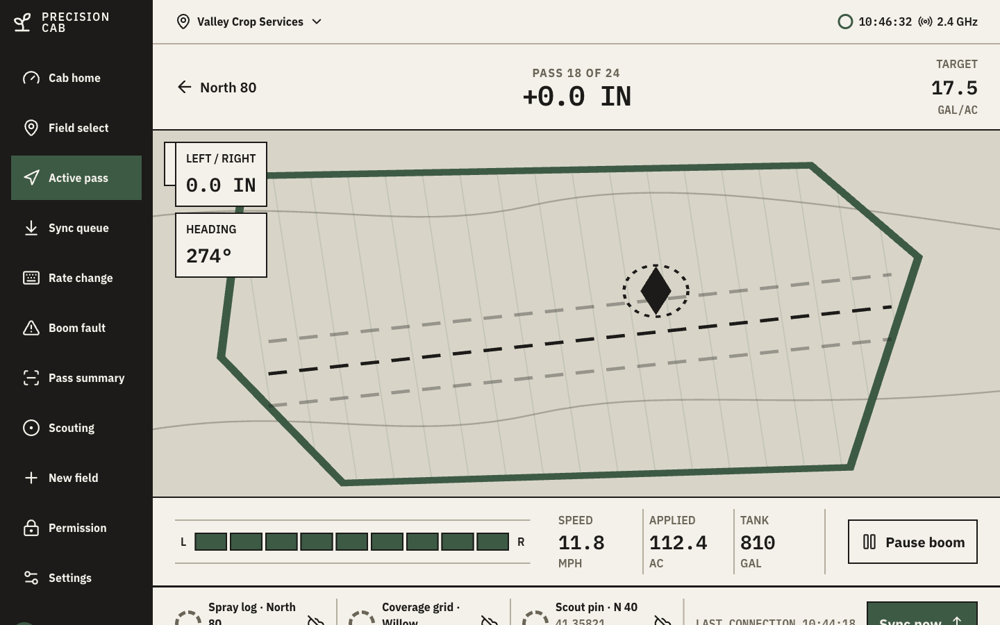
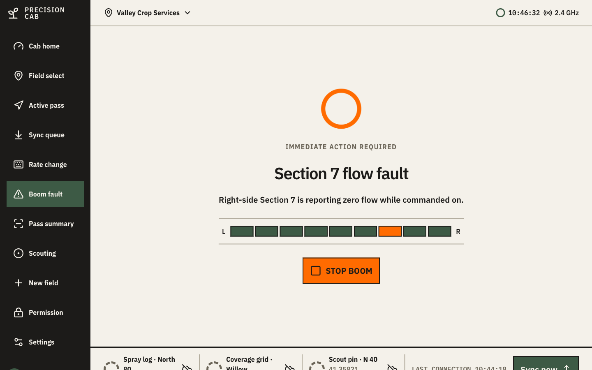
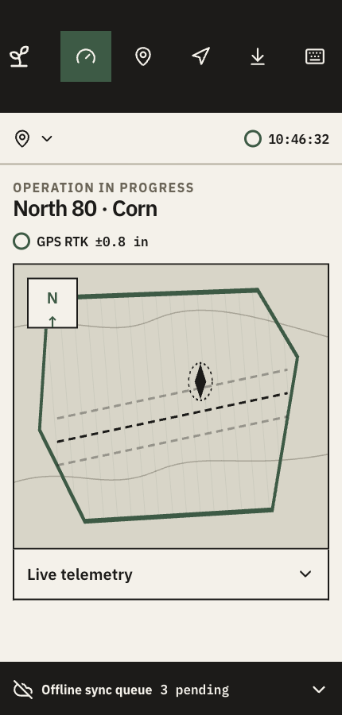

# Precision Cab

**Every pass, precisely applied.**

An in-cab console prototype for GPS-guided precision spray application. 11 screens covering the full operator flow (field selection, live guided application, rate changes, boom fault handling, pass summaries, scouting, offline sync, and settings), built as a single interactive React app with a real industrial-console visual language, not a mockup.

## Screenshots











## Features

- Full operator flow across 11 screens: cab home, field select, active pass guidance, rate change, boom fault, pass summary, scouting capture, offline sync queue, empty/no-boundary state, permission-denied state, settings
- Built-in device switcher (Cab console / Tablet / Handheld) for previewing every breakpoint without resizing the browser, driven by CSS container queries so it reflects the same layout a real narrow viewport would render
- Offline sync queue simulation: queued items transition through waiting → syncing → synced with staggered timing
- Rate-change keypad with live tank-mix math (gallons needed for the new rate, tank reserve remaining)
- Boom section diagram reflects stopped/fault state consistently across the home, active pass, and alert screens
- Field map rendered as SVG with satellite/NDVI mode toggle, guidance lines, and applied/overlap/skip coverage overlays

## Tech stack

React 19, Vite 8, Tailwind CSS 4 (via `@tailwindcss/vite`), `lucide-react` for icons. No backend, no router, no state management library. Screens are plain functions switched by a single `useState`; all data is in-memory mock state.

## Project structure

```
src/
  main.jsx       # every screen component, app shell, and state
  styles.css     # design tokens, component styles, container-query breakpoints
index.html       # entry point
vite.config.js   # Vite + React + Tailwind plugin config
screenshots/     # screenshots used in this README
```

## Architecture

The whole app lives in one component tree in `main.jsx`. Screens are keyed in a `SCREENS` array and switched via a `renderScreen()` function on top-level `useState`. No route matching library.

Responsive layout runs on CSS container queries scoped to `.preview-shell`, not `@media`. The prototype's own device switcher (Cab console / Tablet / Handheld) only ever changes that container's `max-width`. It doesn't resize the real browser window. Media queries keyed to viewport width would never fire from that switcher, so the in-app mobile preview would silently render the desktop layout. Container queries respond to the container's rendered width instead, so switching device mode and shrinking the real window produce identical, correct breakpoint behavior.

## Getting started

```bash
npm install
npm run dev
```

Open the printed local URL. `npm run build` produces a production build in `dist/`.

## Future improvements

- Real GPS/telemetry integration in place of the fixed mock coordinates and rates
- Persistent storage for the sync queue instead of an in-memory simulation
- Deep-linkable screen state (currently reset on reload)

## License

MIT, see [LICENSE](LICENSE).
